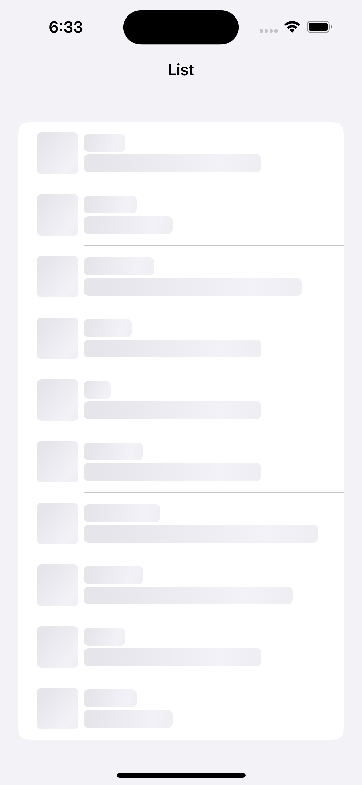

# ShimmerEffect

ShimmerEffect is a lightweight library that provides a custom modifier for SwiftUI views, allowing you to easily add shimmering effects to your UI components.

## Features

- Easily add shimmer effect to any SwiftUI view.
- Customizable shimmer animation speed, gradient colors, and direction.

<html>
 <body>
  <p>
    
  </p>
 </body>
</html>

## Installation

You can install Shimmer-SwiftUI-Modifier using Swift Package Manager. In Xcode, go to File > Swift Packages > Add Package Dependency and enter the repository URL.

```swift
dependencies: [
    .package(url: "https://github.com/0xYanis/Shimmer-SwiftUI-Modifier.git", from: "1.0.0")
]
```

## Usage

Adding shimmer effect to a view is as simple as applying the `shimmer` modifier to it:

```swift
import SwiftUI
import ShimmerEffect

struct ContentView: View {
    var body: some View {
        Text("Hello, Shimmer!")
            .shimmer(true)
    }
}
```

You can customize the shimmer effect by providing parameters to the `shimmerEffect` modifier:

```swift
Text("Hello, Customized Shimmer!")
    .shimmerEffect(isActive: true, speed: 1.2, colors: [.gray, .white], cornerRadius: 8)
```

## License

ShimmerEffect is available under the MIT license. See the [LICENSE](https://github.com/0xYanis/Shimmer-SwiftUI-Modifier/blob/main/LICENSE) file for more info.

## Contributions

Contributions are welcome! Feel free to submit pull requests, create issues, or suggest new features.

## Credits

ShimmerEffect is maintained by [0xYanis]. 

Enjoy using the library and happy shimmering!
